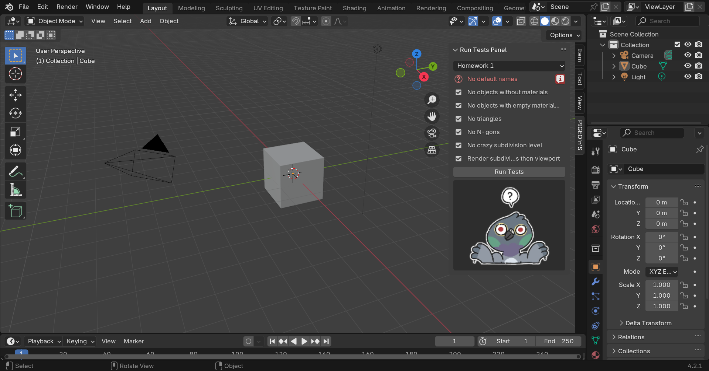

# PIGEO'n'S - Program to Interactively Grade and Evaluate Objects and Scenes


Blender extenension to help with homework grading for course VV035 - 3D Modelling, taught at FI MUNI. Yes, we are proud of the name.

Developed by Dusan as part of semestral project, maintained by KiraaCorsac and other lectors of VV035.

Icons provided by the amazing Clair from @ccartstuff.

---

## Installation

Install from [FI MUNI Blender Extension Repository](https://muni.cz/go/pigeons-repo) (`https://muni.cz/go/pigeons-repo`). Add this as a new repository, refresh, search for an extension named PIGEO'n'S and install.  

## Use

This extension resides in the N-Panel of the 3D Viewport, in the PIGEO'n'S category. Each homework has a separate test battery. Select the appropriate battery and click "Run Tests".



Observe the pigeon to learn about the quality of your homework. 

## Development

You are very welcomed to contribute to development of PIGEO'n'S. We can roll out changes very quickly, so if you help us fix a bug early in the semester, it's likely that students enrolled in the same semester get to see the fix :)

Submit a PR. 
- Describe what you are trying to solve
- Describe how your PR is making this software better 
- Make sure the extension builds
- Create descriptive commits
- Observe the code style (fixes and enhancments welcomed)

For development, use [Blender Development VS Code extension](https://marketplace.visualstudio.com/items?itemName=JacquesLucke.blender-development).

Build releases with
```
blender --command extension build --valid-tags=""
```